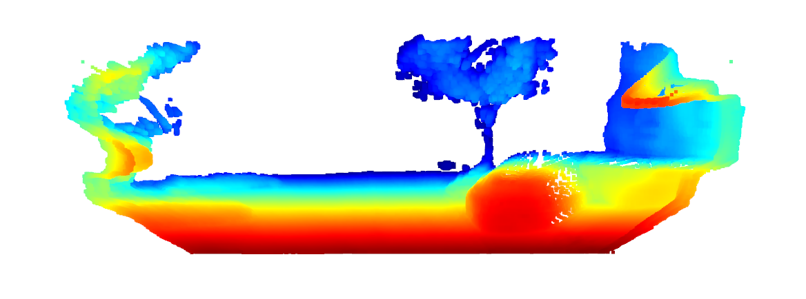
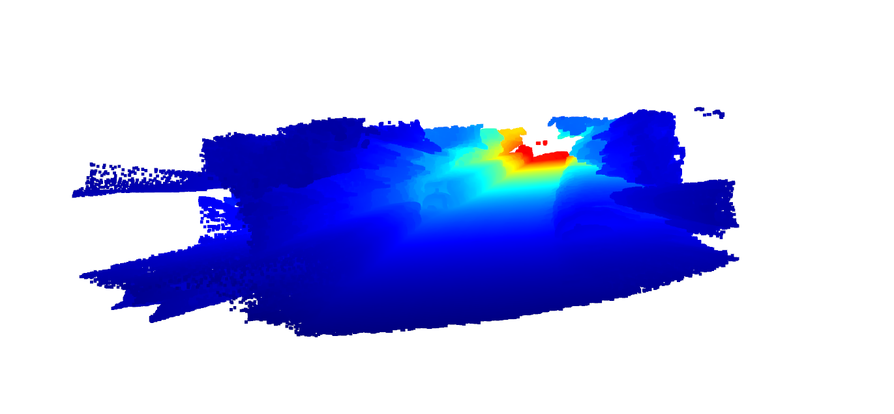
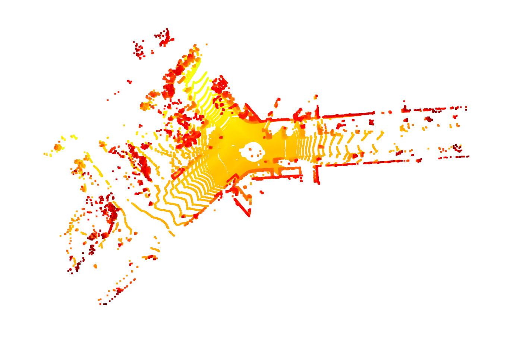
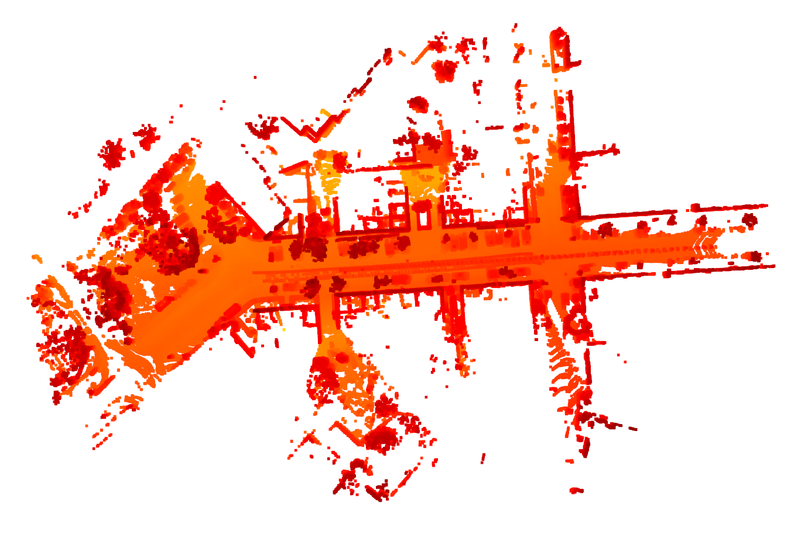
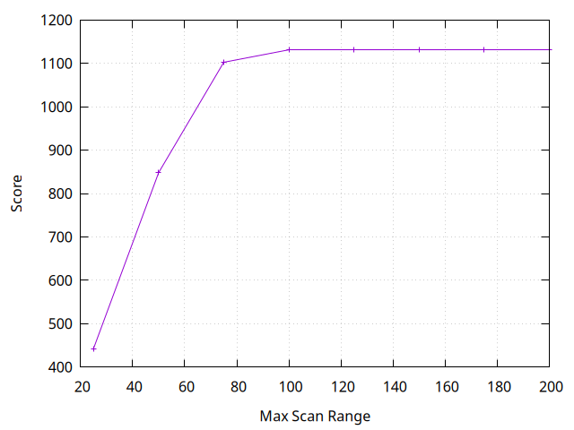
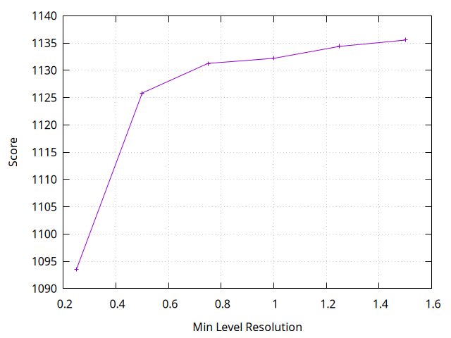
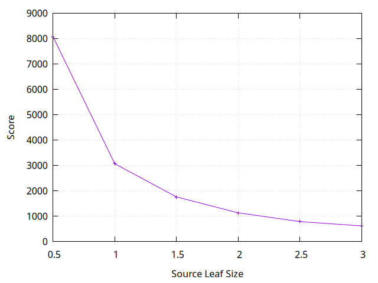

# LiDAR-to-LiDAR Global Localization

## Problem Statement

Perform global localization by matching LiDAR point clouds to a pre-built HD LiDAR map using 3D-BBS (3D Bag of Binary Words) for feature extraction and a Branch-and-Bound (BnB) algorithm for efficient scan matching.

Use monocular depth estimation models to generate depth maps from camera images. Convert the depth maps into a 3D point cloud, that mimics LiDAR data, for localization.

## Generation of Point Cloud from Camera Images using Depth Estimation

<table>
    <tr>
        <td align="center"></td>
        <td align="center"></td>
    </tr>
    <tr>
        <td align="center">Sample RGB Image</td>
        <td align="center">Metric Depth Estimate</td>
    </tr>
    <tr>
        <td align="center"></td>
        <td align="center"></td>
    </tr>
    <tr>
        <td align="center">Projected Point Cloud</td>
        <td align="center">Concatenated Point Cloud</td>
    </tr>
</table>

## Construction of HD LiDAR Map

<table>
    <tr>
        <td align="center"></td>
        <td align="center"></td>
    </tr>
    <tr>
        <td align="center">Sample LiDAR Point Cloud</td>
        <td align="center">LiDAR Map constructed using ICP</td>
    </tr>
</table>

## Global Localization using 3D-BBS

<table>
    <tr>
        <td align="center"></td>
        <td align="center"></td>
        <td align="center"></td>
    </tr>
    <tr>
        <td align="center">Max Scan Range</td>
        <td align="center">Min Level Resolution</td>
        <td align="center">Source Leaf Size</td>
    </tr>
</table>
